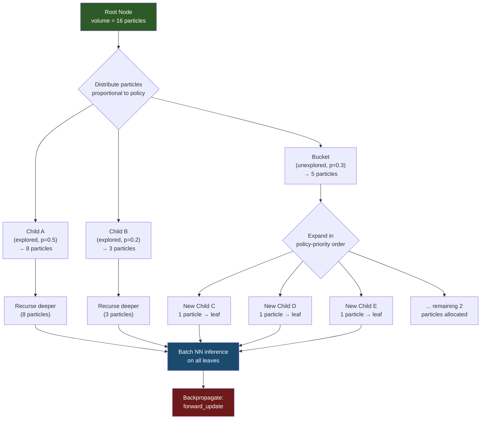
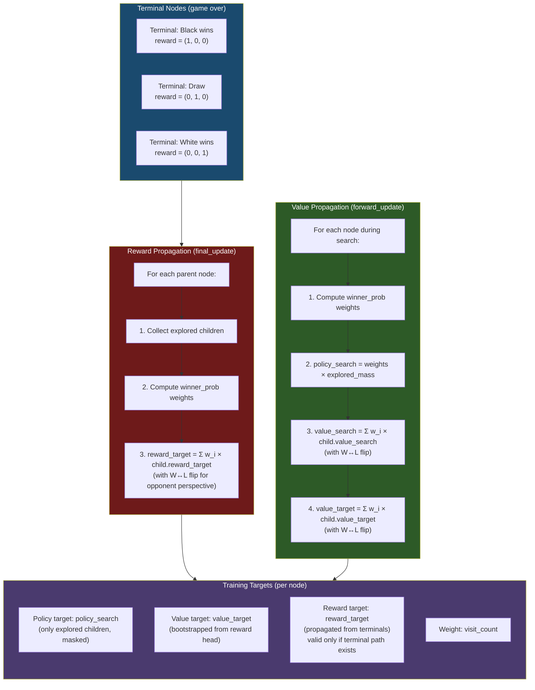
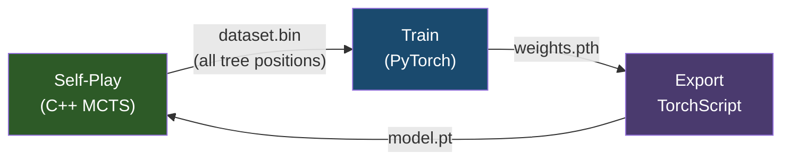

# ProbZero

**Reward-Bootstrapped AlphaZero with Particle-Based MCTS**

A novel AlphaZero variant that introduces reward bootstrapping for value training and full-tree policy extraction, demonstrated on 5×5 Othello (Mini-Othello).

---

## Key Contributions

### 1. Reward-Bootstrapped Value Training
Standard AlphaZero trains the value head from game outcomes (terminal reward only). ProbZero separates this into two concepts:

- **Reward Head**: Trained on terminal game outcomes (ground-truth WDL). The "reward" here refers to the **actual outcome observed at terminal nodes in the MCTS tree**, not the reinforcement learning notion of per-step reward signals.
- **Value Head**: Bootstrapped from the reward head's predictions, propagated backwards through the search tree via `winner_prob` weighting. This means positions never actually reached at game end can still receive meaningful value targets from nearby terminal evaluations.

> **Note**: Reward bootstrapping as a general technique is well-established in RL. The contribution here is applying it within the MCTS tree structure, where a dedicated **reward head** predicts terminal outcomes and these predictions are propagated to non-terminal nodes as value targets through the search tree's structure.

### 2. Full-Tree Policy Training
Rather than training policy targets from only the root node's visit distribution (as in standard AlphaZero):

- Policy targets are extracted from **every explored node** in the search tree
- Only **explored children** are considered (unexplored moves are masked out)
- Targets are computed as WDL probabilities via `winner_prob` over children's values
- Each position's contribution is weighted by its **visit count**

### 3. Particle-Based MCTS
Uses a particle-based tree expansion instead of single-path UCB traversal:

- "Particles" (volume) flow through the tree each simulation batch
- Particles distribute among children proportionally to current policy
- Unexplored moves collect into a "bucket" expanded in policy-priority order
- Enables **batched GPU inference** — all leaf nodes from one batch are evaluated simultaneously

---

## Architecture

### Neural Network

```
Input: 2×5×5 (current player pieces, opponent pieces)
  │
  ▼
Conv2d(2 → 50, 3×3, pad=1) + BatchNorm + ReLU
  │
  ▼
10× Residual Blocks
  │    ┌─────────────────────────────┐
  │    │ Conv(50→50, 3×3) + BN + ReLU│
  │    │ Conv(50→50, 3×3) + BN       │
  │    │ + Skip Connection + ReLU     │
  │    └─────────────────────────────┘
  │
  ├──────────────────┬──────────────────┐
  ▼                  ▼                  ▼
┌────────────┐ ┌────────────┐ ┌────────────┐
│Policy Head │ │ Value Head │ │Reward Head │
│Conv(1×1)   │ │Conv(1×1)   │ │Conv(1×1)   │
│BN + ReLU   │ │BN + ReLU   │ │BN + ReLU   │
│Flatten     │ │Flatten     │ │Flatten     │
│FC(800→26)  │ │FC(800→50)  │ │FC(800→50)  │
│            │ │ReLU        │ │ReLU        │
│→ 26 logits │ │FC(50→3)    │ │FC(50→3)    │
│(25 squares │ │→ WDL probs │ │→ WDL probs │
│ + 1 pass)  │ │(softmax)   │ │(softmax)   │
└────────────┘ └────────────┘ └────────────┘
```

### Particle-Based MCTS Search



### Winner Probability Calculation (`winner_prob`)

The `winner_prob` function converts children's WDL (Win/Draw/Loss) value estimates into a probability distribution over which child is the "winning" move. This is used to update `policy_search` during backpropagation.

For each child *i* with value estimates (W_i, D_i, L_i) from the **parent's perspective** (so child's Win = parent's Loss):

```
For child i:
  p0_i = child's Win probability  (= parent's Loss if chosen)
  p1_i = child's Draw probability
  p2_i = child's Loss probability (= parent's Win if chosen)

Compute products (excluding self):
  prod_lt1 = ∏ (p0_j + ε)  for all j
  prod_lt2 = ∏ (p0_j + p1_j + ε)  for all j

For each child i:
  term1_i = p1_i × prod_lt1 / (p0_i + ε)     ← "I draw, all others lose"
  term2_i = p2_i × prod_lt2 / (p0_i + p1_i + ε)  ← "I win outright"
  
  raw_win_i = term1_i + term2_i

Normalize: weight_i = raw_win_i / Σ raw_win_j
```

**Intuition**: A child gets high weight if (a) the opponent loses when playing it (high p2, meaning parent wins), or (b) the opponent draws while all other children would lose. This selects moves that maximize the parent's winning chances.

### Target Calculation Pipeline



### Loss Function

```
L = L_policy + L_value + L_reward

L_policy = -Σ (target_p · log_softmax(pred_p))    [masked to explored children only]
L_value  = -Σ (target_q · log_softmax(pred_v))    [categorical cross-entropy, WDL]
L_reward = -Σ (target_r · log_softmax(pred_r))    [only for nodes with terminal paths]

All losses weighted by per-sample visit count.
```

---

## Results

Training on 5×5 Othello shows clear Elo progression across self-play iterations:


Later iterations consistently dominate earlier ones, with iter_400 achieving ~359 Elo above the baseline (iter_50). See `elo_estimation.py` for full reproduction.

---

## Project Structure

```
ProbZero/
├── src/
│   ├── game.hpp          # 5×5 Othello engine (bitboard)
│   ├── node.hpp          # MCTS tree node definition
│   ├── mcts.cpp/.hpp     # Particle-based MCTS with winner_prob
│   ├── model.hpp         # LibTorch model wrapper
│   ├── selfplay.hpp      # Self-play data generation (full tree extraction)
│   ├── main.cpp          # Self-play binary (data generator)
│   └── play.cpp          # Arena binary (model vs model)
├── train.py              # PyTorch training loop
├── auto_loop.py          # Automated self-play → train loop
├── master.py             # Distributed training coordinator
├── worker.py             # Distributed self-play worker
├── arena.py              # Elo tournament runner
├── convert_pt.py         # Weight → TorchScript converter
├── elo_estimation.py     # Kaggle-ready Elo estimation script
├── 5x5_othello_models/   # Pre-trained model checkpoints
├── CMakeLists.txt        # C++ build configuration
├── CITATION.cff          # Citation metadata
└── LICENSE               # Apache 2.0
```

---

## Training Pipeline



### Data Format (Binary)
Each sample: `Board(50) + Policy(26) + Mask(26) + Value(3) + Reward(3) + Valid(1) + Weight(1)` = 110 floats

---

## Building

### Requirements
- LibTorch (C++17)
- PyTorch (Python)
- CUDA (recommended) or CPU

### Compile
```bash
mkdir -p build && cd build
cmake .. -DCMAKE_PREFIX_PATH=/path/to/libtorch
make -j$(nproc)
```

### Quick Start
```bash
# 1. Initialize a random model
python train.py

# 2. Run self-play (generates dataset.bin)
./build/c4_engine model_script.pt dataset.bin 60 20

# 3. Train on generated data
python train.py

# 4. Repeat (or use auto_loop.py)
python auto_loop.py
```

### Arena (Model vs Model)
```bash
# AI vs AI parallel arena (20 games)
./build/play 4 model_a.pt model_b.pt 20
```

---

## Future Work

- **Replay Buffer**: Implement experience replay to reuse training data across iterations, improving sample efficiency
- **Extended Training**: Scale to more self-play iterations with longer training schedules
- **8×8 Othello**: Adapt the architecture and search to standard Othello, requiring deeper residual networks and more MCTS simulations — will need significant compute scaling
- **Hyperparameter Tuning**: Systematic exploration of particle volume, batch size, temperature scheduling, and `winner_prob` temperature

---

## Citation

If you use this work, please cite:

```bibtex
@software{probzero2026,
  title={ProbZero: Reward-Bootstrapped AlphaZero with Particle-Based MCTS},
  author={Mothish M},
  year={2026},
  url={https://github.com/chrono-motz/ProbZero},
  license={Apache-2.0}
}
```

## License

Apache License 2.0 — see [LICENSE](LICENSE) for details.
