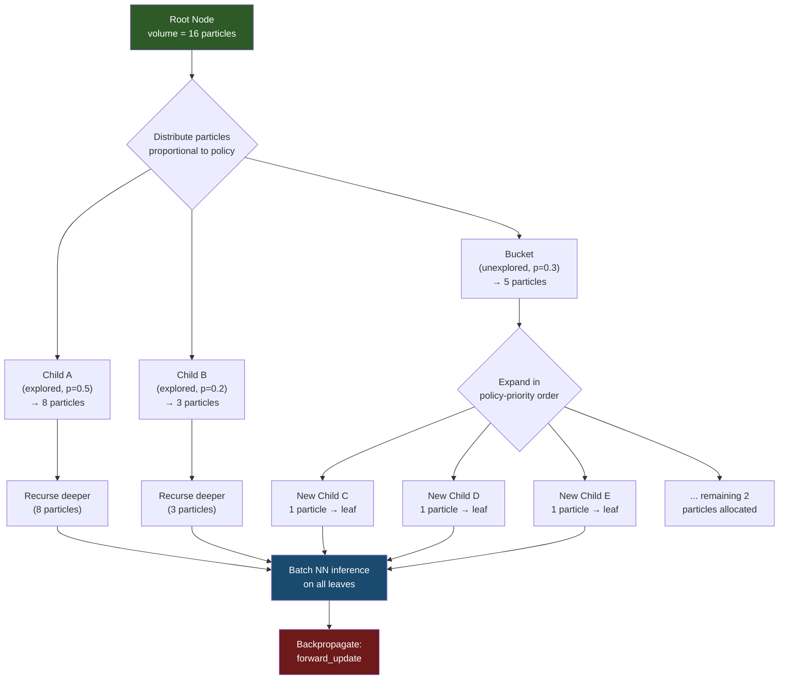
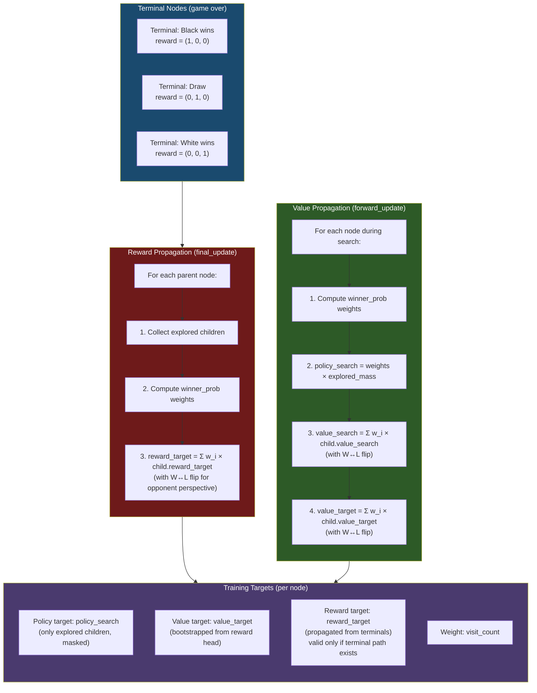

# ProbZero

**Reward-Bootstrapped AlphaZero with Full-Tree Policy Training**

A novel AlphaZero variant that introduces two key modifications to the standard algorithm, demonstrated on 5×5 Othello (Mini-Othello).

## Key Innovations

### 1. Reward-Bootstrapped Value Head
Instead of training the value head directly from game outcomes (as in standard AlphaZero), ProbZero:
- Trains a **reward head** on terminal states (ground-truth win/draw/loss)
- Bootstraps the **value head** using the reward head's predictions after MCTS search
- This allows **all explored positions** (not just game-played positions) to contribute meaningful value targets

### 2. Full-Tree Policy Training
Standard AlphaZero trains the policy on the root node's visit distribution. ProbZero instead:
- Extracts policy targets from **all explored nodes** in the search tree
- Only considers **explored children** for each node (unexplored moves are masked)
- Computes policy targets as WDL (Win/Draw/Loss) probabilities derived from children's values
- Weights each position's contribution by **visit count**

### 3. Particle-Based MCTS
Uses a particle-based tree expansion where "volume" (particles) flows through the tree:
- Particles are distributed among children proportionally to the current policy
- Unexplored moves collect into a "bucket" that gets expanded in priority order
- Enables efficient batched GPU inference during tree expansion

## Architecture

### Neural Network

```
Input: 2×5×5 (self pieces, opponent pieces)
  ↓
Conv2d(2 → 50, 3×3) + BN + ReLU
  ↓
10× ResBlock(50 channels, 3×3)
  ↓
┌─────────────────┬──────────────────┬──────────────────┐
│   Policy Head   │   Value Head     │   Reward Head    │
│ Conv(50→32,1×1) │ Conv(50→32,1×1)  │ Conv(50→32,1×1)  │
│ FC(800→26)      │ FC(800→50→3)     │ FC(800→50→3)     │
│ → 26 logits     │ → 3 (L,D,W)     │ → 3 (L,D,W)     │
└─────────────────┴──────────────────┴──────────────────┘
```

### Particle-Based MCTS Search



### Target Calculation Pipeline



### Winner Probability Calculation (`winner_prob`)
The `winner_prob` function converts children's WDL value estimates into a probability distribution over which child is the "winning" move. This is used to update `policy_search` during backpropagation.

## Project Structure

```
ProbZero/
├── src/                  # C++ Engine Source
│   ├── game.hpp          # 5×5 Othello logic
│   ├── mcts.cpp/hpp      # Particle-based MCTS
│   ├── model.hpp         # LibTorch wrapper
│   └── ...               # Core logic
├── scripts/              # Python Scripts
│   ├── run.py            # Main training loop (self-play + train)
│   ├── train.py          # PyTorch training logic
│   └── elo_estimation.py # Elo evaluation script
├── models/               # Saved model checkpoints (.pt)
├── results/              # Elo plots and results
├── build/                # Compiled C++ binaries
├── CMakeLists.txt        # Build config
└── README.md
```

## Training Pipeline

```
┌──────────────┐     ┌──────────────┐     ┌──────────────┐
│  Self-Play   │────▶│  Train.py    │────▶│  Export .pt   │
│  (C++ MCTS)  │     │  (PyTorch)   │     │  (TorchScript)│
│  dataset.bin │     │  weights.pth │     │  model.pt     │
└──────────────┘     └──────────────┘     └───────┬───────┘
       ▲                                          │
       └──────────────────────────────────────────┘
                    (loop)
```

### Loss Function
```
L = L_policy + L_value + L_reward

L_policy = -Σ(target_p · log_softmax(pred_p))    [masked to explored children]
L_value  = -Σ(target_q · log_softmax(pred_v))    [categorical cross-entropy]
L_reward = -Σ(target_r · log_softmax(pred_r))    [only terminal states]
```

## Quick Start

### 1. Requirements
- **LibTorch C++ (1.13+)**: Download the C++ version of PyTorch for your system/CUDA version.
- **Python**: PyTorch installed (`pip install torch`)
- **CMake**: Build system

### 2. Build C++ Engine
Set `CMAKE_PREFIX_PATH` to your LibTorch directory.

```bash
mkdir -p build && cd build
cmake .. -DCMAKE_PREFIX_PATH=/path/to/libtorch
make -j$(nproc)
cd ..
```

### 3. Run Training
This script manages the self-play → training loop automatically.

```bash
python scripts/run.py
```

### 4. Evaluate Models (Elo)
To run an arena tournament between saved checkpoints (in `models/`):

```bash
python scripts/elo_estimation.py
```
This will generate `results/elo_progression.png`.

## Results

Training on 5×5 Othello shows clear Elo progression across iterations. See `results/elo_results.txt` for raw data.


## Future Work

> [!NOTE]
> This is currently **preliminary work** with many features still in development or missing.

- **Multithreading**: Implement parallelized tree search (virtual loss or tree-parallelization) for massive speedups.
- **Distributed Training**: Scale self-play generation across multiple nodes/GPUs (replacing the initial master-worker design).
- **Replay Buffer**: Prioritized experience replay to improve sample efficiency.
- **8×8 Othello**: Adapt architecture for standard Othello (requires deeper ResNets).
- **Hyperparameter Tuning**: Optimize particle count, exploration noise, and `winner_prob` temperature.

## Citation

If you use this work, please cite:

```bibtex
@software{probzero2026,
  title={ProbZero: Reward-Bootstrapped AlphaZero with Full-Tree Policy Training},
  author={Mothish},
  year={2026},
  url={https://github.com/chrono-motz/ProbZero},
  license={Apache-2.0}
}
```

## License

Apache License 2.0 — see [LICENSE](LICENSE) for details.
