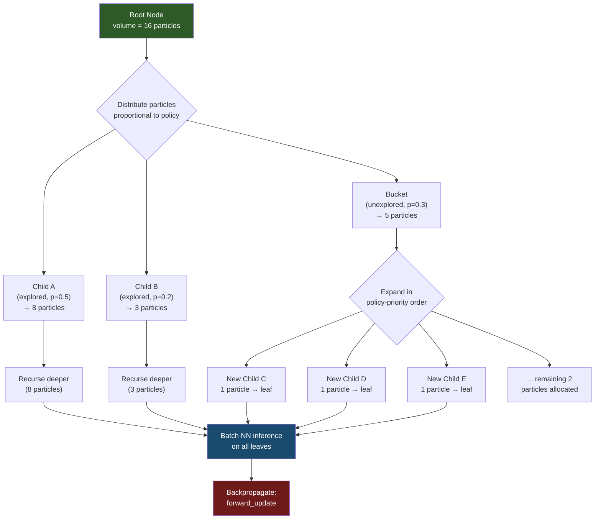
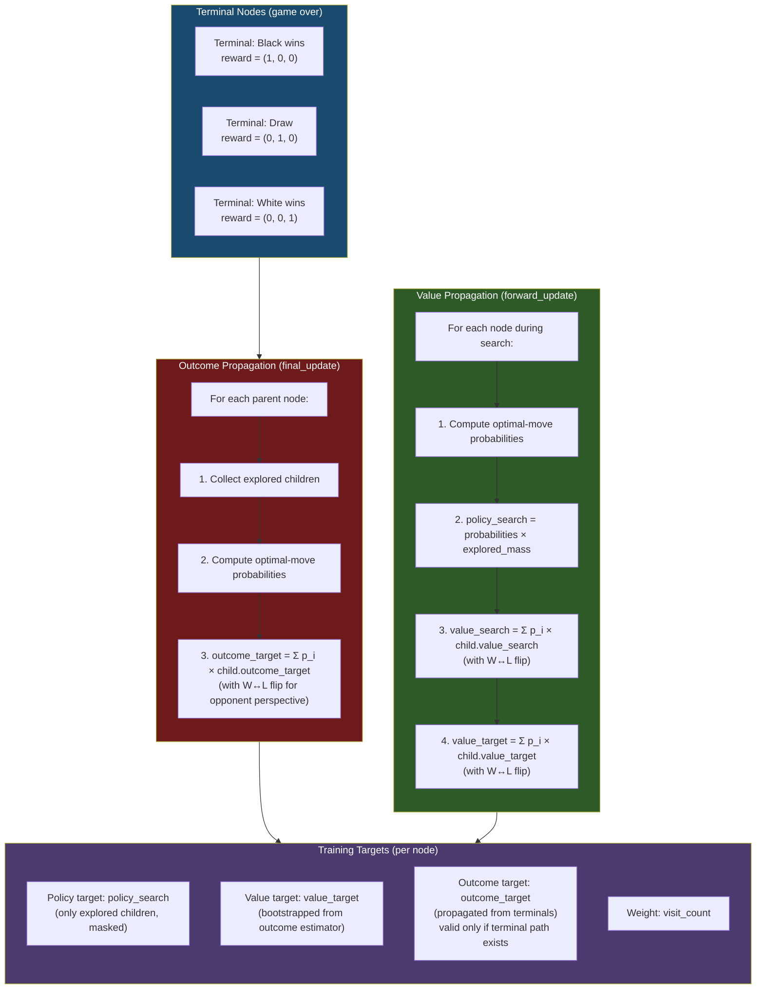

# ProbZero

[](https://doi.org/10.5281/zenodo.18701250)

### A Full-Search Reinforcement Learning Framework

ProbZero is an AlphaZero-inspired reinforcement learning framework that attempts to maximize utilization of expensive search computations by learning from entire search trees rather than only compressed root-level search outcomes.

> **Note:** ProbZero is an experimental framework exploring full-search supervision and alternative policy/value formulations. It does not claim superiority to AlphaZero without direct empirical comparisons, but serves as a testbed for novel reinforcement learning search architectures.

---

## Key Ideas

### Full-Search Supervision

For a typical Othello game, AlphaZero may perform tens of thousands of search expansions but ultimately trains on a highly compressed summary of that search. 

ProbZero attempts to recover training signal from all explored search states rather than only root-level outcomes.

This allows training to leverage thousands of explored search states generated during self-play rather than only a compressed root-level summary.

---

### Why Full-Search Learning Requires New Targets

Simply applying full-tree supervision to AlphaZero is problematic.

AlphaZero policies imitate visit-count distributions generated by search. When supervision is extracted from every explored node, exploratory actions receive training credit even when they are known to be suboptimal.

ProbZero addresses this by predicting optimal-move probabilities derived from search value estimates rather than visit-count distributions.

---

### Outcome–Value Decoupling

Learning from complete search trees introduces stability challenges.

Directly propagating value estimates across complete search trees can lead to unstable averaging effects. ProbZero therefore separates grounded terminal supervision from generalized value estimation.

ProbZero addresses this using two separate estimators:

- Outcome Estimator
- Value Estimator

The outcome estimator learns directly from terminal trajectories.

The value estimator is bootstrapped from outcome estimates and generalizes to incomplete positions.

This decoupling enables stable tree-wide learning while preserving grounded terminal supervision.

---

### Optimal-Move Probability Learning

AlphaZero policies imitate search visit distributions.

ProbZero instead predicts:

`P(move is optimal)`

derived from search value estimates.

This removes the dependence between policy learning and exploration behavior.

Benefits:

- Full-tree supervision becomes feasible.
- Exploration noise does not directly corrupt targets.
- Search no longer needs visit-count based objectives.

---

### Probabilistic Parallel Search

Because policy learning is based on optimal-move probabilities rather than visit distributions, search can be reformulated.

ProbZero introduces a probabilistic search framework that supports massively parallel batched inference.

- **Eliminates Dirichlet-noise injection**.
- **Virtual Loss**: Because search is probabilistic rather than greedily selecting a single best path, concurrent expansions naturally diversify search trajectories, reducing the need for virtual-loss style coordination.
- **Replay Buffers**: The current implementation operates without replay buffers, relying instead on probabilistic search and dense full-tree supervision for data diversity.

Search volume is distributed probabilistically through the tree instead of following traditional sequential MCTS expansion.

---

## Comparison with AlphaZero

| Component | AlphaZero | ProbZero |
| :--- | :--- | :--- |
| **Training Signal** | Root Only | Full Tree |
| **Policy Target** | Visit Counts | Optimal-Move Probability |
| **Value Learning** | Single Head | Outcome + Value |
| **Search** | Sequential MCTS | Probabilistic Parallel Search |
| **Virtual Loss** | Required | Not Used |
| **Replay Buffer** | Common | Not Used (Current Implementation) |

---

## Technical Architecture

### Target Generation Flow

```text
       Full Search Tree
              ↓
      Outcome Estimator
              ↓
       Value Estimator
              ↓
 Optimal-Move Probabilities
        ├── Policy Targets
        └── Probabilistic Search
```

### Neural Network Architecture (Dynamically Sized)

```text
Input: 2 × N × N (self pieces, opponent pieces)
  ↓
Conv2d(2 → 50, 3×3) + BN + ReLU
  ↓
10× ResBlock(50 channels, 3×3)
  ↓
┌─────────────────────┬──────────────────────┬──────────────────────┐
│     Policy Head     │      Value Head      │    Outcome Head      │
│  Conv(50→32,1×1)    │   Conv(50→32,1×1)    │   Conv(50→32,1×1)    │
│  FC(→ N×N+1)        │   FC(→ 50 → 3)       │   FC(→ 50 → 3)       │
│  → (N×N+1) logits   │   → 3 (L,D,W)        │   → 3 (L,D,W)        │
└─────────────────────┴──────────────────────┴──────────────────────┘
```

### Probabilistic Search Flow


```mermaid
flowchart TD
    A["Root Node<br/>volume = 16 particles"] --> B{"Distribute particles<br/>proportional to policy"}
    B --> C["Child A<br/>(explored, p=0.5)<br/>→ 8 particles"]
    B --> D["Child B<br/>(explored, p=0.2)<br/>→ 3 particles"]
    B --> E["Bucket<br/>(unexplored, p=0.3)<br/>→ 5 particles"]

    C --> F["Recurse deeper<br/>(8 particles)"]
    D --> G["Recurse deeper<br/>(3 particles)"]
    E --> H{"Expand in<br/>policy-priority order"}
    H --> I["New Child C<br/>1 particle → leaf"]
    H --> J["New Child D<br/>1 particle → leaf"]
    H --> K["New Child E<br/>1 particle → leaf"]
    H --> L["... remaining 2<br/>particles allocated"]

    I --> M["Batch NN inference<br/>on all leaves"]
    J --> M
    K --> M
    F --> M
    G --> M

    M --> N["Backpropagate:<br/>forward_update"]

    style A fill:#2d5a27,color:#fff
    style M fill:#1a4a6e,color:#fff
    style N fill:#6e1a1a,color:#fff
```

### Target Calculation Pipeline


```mermaid
flowchart TB
    subgraph TerminalNodes["Terminal Nodes (game over)"]
        T1["Terminal: Black wins<br/>reward = (1, 0, 0)"]
        T2["Terminal: Draw<br/>reward = (0, 1, 0)"]
        T3["Terminal: White wins<br/>reward = (0, 0, 1)"]
    end

    subgraph RewardProp["Outcome Propagation (final_update)"]
        direction TB
        R1["For each parent node:"]
        R2["1. Collect explored children"]
        R3["2. Compute optimal-move probabilities"]
        R4["3. outcome_target = Σ p_i × child.outcome_target<br/>(with W↔L flip for opponent perspective)"]
        R1 --> R2 --> R3 --> R4
    end

    subgraph ValueProp["Value Propagation (forward_update)"]
        direction TB
        V1["For each node during search:"]
        V2["1. Compute optimal-move probabilities"]
        V3["2. policy_search = probabilities × explored_mass"]
        V4["3. value_search = Σ p_i × child.value_search<br/>(with W↔L flip)"]
        V5["4. value_target = Σ p_i × child.value_target<br/>(with W↔L flip)"]
        V1 --> V2 --> V3 --> V4 --> V5
    end

    subgraph Training["Training Targets (per node)"]
        direction TB
        L1["Policy target: policy_search<br/>(only explored children, masked)"]
        L2["Value target: value_target<br/>(bootstrapped from outcome estimator)"]
        L3["Outcome target: outcome_target<br/>(propagated from terminals)<br/>valid only if terminal path exists"]
        L4["Weight: visit_count"]
    end

    TerminalNodes --> RewardProp
    RewardProp --> Training
    ValueProp --> Training

    style TerminalNodes fill:#1a4a6e,color:#fff
    style RewardProp fill:#6e1a1a,color:#fff
    style ValueProp fill:#2d5a27,color:#fff
    style Training fill:#4a3a6e,color:#fff
```

---

## Experimental Results

### 4×4 Othello

The strongest current validation.

After approximately 20 self-play iterations:

- Achieved optimal play on solved 4×4 Othello.
- Defeated a perfect-play engine as the second player.
- Correctly predicted game-theoretic outcomes throughout complete games.

This demonstrates that ProbZero can recover optimal behaviour using the proposed training framework.

---

### 6×6 Othello

Training completed for approximately 80 iterations.

Results remain preliminary and require further evaluation.

---

## Quick Start

### 1. Requirements
- **LibTorch C++ (1.13+)**: Download the C++ version of PyTorch for your system/CUDA version.
- **Python**: PyTorch installed (`pip install torch`)
- **CMake**: Build system

### 2. Build C++ Engine
Set `CMAKE_PREFIX_PATH` to your LibTorch directory.

```bash
mkdir -p build && cd build
cmake .. -DCMAKE_PREFIX_PATH=/path/to/libtorch
make -j$(nproc)
cd ..
```

### 3. Run Training
This script manages the self-play → training loop automatically, and will prompt you to pick a board size (e.g. 4 or 6).

```bash
python scripts/run.py
```
Alternatively, specify the board size explicitly:
```bash
python scripts/run.py --size 4
```

---

## Project Structure

```
ProbZero/
├── src/                  # C++ Engine Source
│   ├── game.hpp          # Dynamic N×N Othello logic
│   ├── mcts.cpp/hpp      # Probabilistic MCTS implementation
│   ├── model.hpp         # LibTorch wrapper
│   └── main.cpp          # Entry point & CLI handler
├── scripts/              # Python Scripts
│   ├── run.py            # Main training loop (self-play + train)
│   ├── train.py          # PyTorch training logic
│   └── elo_estimation.py # Elo evaluation script
├── models/               # Saved model checkpoints
│   ├── 4x4/
│   └── 6x6/
├── CMakeLists.txt        # Build config
└── README.md
```

## Citation

If you use this work, please cite:

```bibtex
@software{probzero2026,
  doi={10.5281/zenodo.18701250},
  title={ProbZero: A Full-Search Reinforcement Learning Framework},
  author={Mothish},
  year={2026},
  url={https://github.com/chrono-motz/ProbZero},
  license={Apache-2.0}
}
```

## License

Apache License 2.0 — see [LICENSE](LICENSE) for details.
